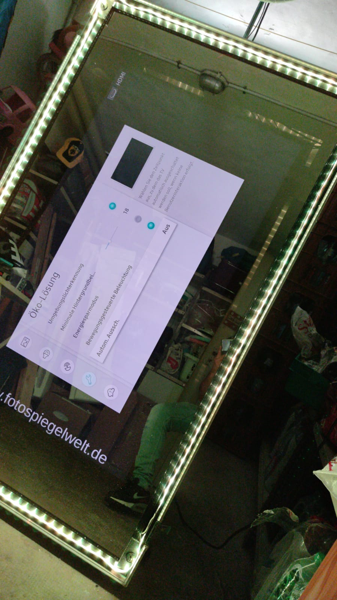

<div align="center">
  <a href="https://www.fotospiegelwelt.de/">
    
  </a>
</div>

# Photobooth

This project was generated with [Angular CLI](https://github.com/angular/angular-cli) version 8.3.20.

# Installation instructions

## Install global dependencies

The following global npm dependencies are needed

```bash
# install imagemagick for image compositing of printer templates
# see here: https://imagemagick.org/index.php
sudo apt-get install -y imagemagick

# see here: http://www.gphoto.org/
sudo apt-get install -y libgphoto2-dev
sudo apt-get install -y gphoto2 

# libcairo for usage with https://www.npmjs.com/package/fabric
# see here: https://www.cairographics.org/download/
sudo apt-get install -y libcairo2-dev

# install `node` using Ubuntu
# see here: https://github.com/nodesource/distributions#debinstall
curl -sL https://deb.nodesource.com/setup_13.x | sudo -E bash -
sudo apt-get install -y nodejs
sudo apt-get install -y build-essential
sudo apt-get install -y udev

# install other global npm dependencies
sudo npm install license-checker -g
sudo npm install @angular/cli -g
sudo npm install typescript -g 
sudo npm install pm2@latest -g 
sudo npm install ts-node -g
sudo npm install ts-node-dev -g
sudo npm install tslint -g
sudo npm install express -g
sudo npm install @types/express -g
sudo npm install concurrently -g
sudo npm install canvas -g --unsafe-perm=true --allow-root
```

### What to do if you use NVM for nodejs

Please note that if you use NVM for node and npm you must not install nodejs through `apt-get`, otherwise you are intermixing different nodejs installations on your system.
Also create symlinks to `/usr/local/bin` otherwise you won't have `node` and `npm` available with `sudo`. Create the links like this:

```
sudo ln -s "$NVM_DIR/versions/node/$(nvm version)/bin/node" "/usr/local/bin/node"
sudo ln -s "$NVM_DIR/versions/node/$(nvm version)/bin/npm" "/usr/local/bin/npm"
sudo ln -s "$NVM_DIR/versions/node/$(nvm version)/bin/npx" "/usr/local/bin/npx"
```

## Build and run application

```bash
# install all node dependencies
npm install

# build and serve app
npm run build && sudo -E npm run serve:dev
```
Navigate to `http://localhost:4200/`. The app will automatically reload if you change any of the source files.

## Running unit tests

Run `ng test` to execute the unit tests via [Karma](https://karma-runner.github.io).

## Running end-to-end tests

Run `npm run e2e-gui` to execute the GUI based end-to-end tests via [Cypress](https://docs.cypress.io/).

Run `npm run e2e` to execute the headless end-to-end tests via [Cypress](https://docs.cypress.io/).

## Updating all node dependencies to their latest version

See this article: https://flaviocopes.com/update-npm-dependencies/

# Mocking the DSLR and Printer

If you want to start testing without using a DSLR you can enable DSLR mocking mode with

```bash
export PHOTOBOOTH_CAMERA_MOCK=1
```

Please note: You need internet connectivity for this to work since the mocked photos will now be fetched at https://picsum.photos

Likewise if you want to mock the printer you can use the CUPS PDF printer instead. As before you can enable mocking with

```bash
export PHOTOBOOTH_PRINTER_MOCK=1
```

Result PDFs are located at `${HOME}/PDF` or `/var/spool/cups`. If you want to know exactly where they are put look for the `Out` config in `/etc/cups/cups-pdf.conf`

# Changing the base config path

You can decide to change the base config path from `~/.magic-mirror-photobooth` to another path by setting the `PHOTOBOOTH_BASE_PATH` env variable. For Cypress testing the base path should be

```bash
 export PHOTOBOOTH_BASE_PATH=$(pwd)/cypress/fixtures
```

# LED ring setup

The microcontroller used for controlling the LED ring is

`ARDUINO MICRO, Code: A000053, ATmega32U4 microcontroller`

Where to order:
* https://www.amazon.com/-/de/gp/product/B00AFY2S56/ref=ppx_yo_dt_b_asin_image_o00_s00?ie=UTF8&psc=1
* https://store.arduino.cc/arduino-micro

## Flashing the Arduino

### Install the Arduino IDE

Install the IDE from [here](https://www.arduino.cc/en/main/software). For using Arduino IDE disable ModemManager in Linux otherwise it interferes with the Arduino I/O

```bash
systemctl status ModemManager.service
systemctl disable ModemManager.service
```

## Install the Arduino CLI

Alternatively you can use the [Arduino CLI](https://github.com/arduino/arduino-cli) to flash sketches on your Arduino.

### Flash `FIRMATA` on Arduino

You need to flash the `FIRMATA` library on the Arduino. You can find the source files [here](https://github.com/ajfisher/node-pixel/tree/v0.10.2/firmware/build/node_pixel_firmata)

# Check Licenses

You can use the `license-checker` module to check the included node module licenses

```bash
license-checker | grep licenses | sort | uniq
```

# Increase inotify watches

There might be processes holding too many file handles. You can increase the number of watches like this
```bash
sudo echo "fs.inotify.max_user_watches=1048576" >> /etc/sysctl.conf
```

# Composite images over each other

With imagemagick's `composite` or `convert` (still using Imagemagick 6.x) cli tools you can composite images one over another for rendering the print templates

```bash
convert -size 1795x1205 xc:none \
\( built/01.jpg -resize 500x300 -repage +30+300 \) \
\( built/02.jpg -resize 500x300 -repage +600+300 \) \
\( built/03.jpg -resize 500x300 -repage +900+300 \) \
-layers flatten built/photos.png
convert built/photos.png built/christmas_01_overlay_base_03.png -compose over -composite ./built/result.png


# check image dimensions
identify -format "%[fx:w]x%[fx:h]" built/02.jpg
```

# Test composition layouts

You can also test out composition layouts, e.g. the positioning of the logo and text you want to overlay

```bash
magick convert -size 1795x1205 xc:none \
./built/tmp.png \
-composite /home/dentsads/.magic-mirror-photobooth/assets/wedding_01_overlay_base_03_01.png \
-composite \( /home/dentsads/.magic-mirror-photobooth/assets/fotospiegelwelt_logo2_scaled.png -resize 80 \) \-geometry +30+1065 \
\( -pointsize 30 -annotate +110+1120 'www.fotospiegelwelt.de' \) \
-composite /tmp/65a0e686-424b-4c91-bda6-7241bb2d7fe2_collage.png
```
# PM2 process management

## Install pm2 startup script for systemd

```bash
# https://pm2.keymetrics.io/docs/usage/startup/
sudo pm2 startup

sudo pm2 start npm --name "magic-mirror-server" -- run start:server
sudo pm2 start npm --name "magic-mirror-client" -- run start:client

sudo pm2 save
```

then when executing

```bash
sudo systemctl status pm2-root.service 
```

this might return `status=failed`. A fresh reboot of the OS mitigates this. See here: https://www.freedesktop.org/software/systemd/man/systemd.service.html#Restart=
for a list of when the systemd service will be restarted (default = on-failure)

Now the service starts everytime you reboot or some system failure happens.

You can disable the service with 

```bash
sudo systemctl stop pm2-root.service
sudo systemctl disable pm2-root.service 
```

## Using PM2

```bash
# list processes
sudo pm2 list

# process details for process 0
sudo pm2 describe 0

# show monitoring info (logs, system info)
sudo pm2 monit
```

# Gphoto2

see issue: https://github.com/gphoto/gphoto2/issues/181 when encountering 
 the `Could not claim the USB device` error.

For a quick fix this helps

```
sudo killall gvfs-gphoto2-volume-monitor
sudo killall gvfsd-gphoto2
```

## Nikon D5200 setup

Configuration steps on the camera for best results

* You have to disable the `Ausloesesperre` from the settings menu under `system` for capturing to work
* You have to set the wheel on exposure mode `M`. See [here](https://imaging.nikon.com/support/digitutor/d5300/functions/shootingmodes_m.html) for detailed explanations
* Set camera from `Active Focus (AF)` to `Manual Focus (MF)` through the physical button on the lens
* Turn the lens to the widest setting `18mm`
* Set the shutter speed to `1/100`. See [here](https://imaging.nikon.com/support/digitutor/d5300/functions/shootingmodes_m.html) for detailed explanations
* Change the aperture to `F8`. See [here](https://imaging.nikon.com/support/digitutor/d5300/functions/shootingmodes_m.html) for detailed explanations
* Change the ISO to `1600`

For a list of restrictions on the remote control capabilities of your camera see here: http://www.gphoto.org/doc/remote/

# TV setup

Configuration steps on the TV

 * Increase brightness to maximum level
 * Disable automatic standby mode when idle. In the settings go to `Öko-Lösung` and set `Autom. Aussch.` to `Aus`

  

# Using the LED ring

You can prepare the LED ring by using `PIN 6` of the Arduino Nano for data input on the ring, plugging it into USB and starting the server 

```bash
npm run start:server
```

Now you can trigger the ring by using the REST API

```bash
# trigger LED 'ball' animation mode
curl -H "Content-Type: application/json" \
-d '{"direction":"RIGHT", "color":"rgb(0, 50, 0)", "duration":2000, "loops":3}' \
-X POST  http://localhost:4201/api/led/ball

# trigger LED 'barrel' animation mode
curl -H "Content-Type: application/json" \
-d '{"direction":"RIGHT", "color":"rgb(0, 50, 0)", "duration":5000, "shiftDelay": 500}' \
-X POST  http://localhost:4201/api/led/barrel
```

Please beware. In production mode with angular the server is proxied through port `4200` instead of `4201`.

# Configuring Printer

## Installing Gutenprint driver 5.3.4 from source

First you need to download the gutenprint snapshot tarball from [here](https://sourceforge.net/projects/gimp-print/files/snapshots/)
and untar it.

Then you need to install the following dependencies and build the driver

```bash
sudo apt-get install -y autoconf
sudo apt-get install -y autopoint
sudo apt-get install -y byacc
sudo apt-get install -y cvs
sudo apt-get install -y docbook-utils
sudo apt-get install -y doxygen
sudo apt-get install -y flex
sudo apt-get install -y gettext
sudo apt-get install -y libglib2.0-dev
sudo apt-get install -y libtool
sudo apt-get install -y pkg-config
sudo apt-get install -y sgmltools-lite
sudo apt-get install -y texi2html
sudo apt-get install -y libcups2-dev
sudo apt-get install -y libusb-1.0-0-dev
sudo apt-get install -y libglib2.0-dev libgtk2.0-dev libgimp2.0-dev

# build the gutenprint driver from source and install it
./configure
make
sudo make install
```

Note: When the Gutenprint packages get updated, the printers using Gutenprint drivers will stop working until you run `cups-genppdupdate` as root and restart CUPS. `cups-genppdupdate` will update the PPD files of the configured printers.

```bash
sudo cups-genppdupdate -x
sudo systemctl restart cups

open http://localhost:631
```

## Getting the best results

The following printer options are recommended

```
StpColorCorrection=Raw
StpColorPrecision=Best
StpImageType=Photo
```

You should also use the ICC profile from DNP directly:

http://git.shaftnet.org/cgit/selphy_print.git/tree/icm/DNP/DNP_DS620/DS620-R0.icc

or you can download it from the official website [here](http://dnpphoto.com/en-us/Support/Downloads/Drivers-Tools)

See [here](https://help.ubuntu.com/stable/ubuntu-help/color-howtoimport.html.en) for instructions on how to import color profiles in Ubuntu

## Issue installing ICC profile in Ubuntu 18.04 LTE

If you cannot import the ICC profile in Ubuntu 18.04 you may have a problem with `colord`. See [this issue](https://hub.displaycal.net/forums/topic/profile-installation-failure/)

You can fix this by installing `colord-kde` and rebooting your machine

```bash
sudo apt-get install -y colord-kde
```

## Printing with `lp` from the command line

```bash
# using printer DNP-DS620 and printing image.png
sudo lp -d DNP-DS620 image.png
```

## scaling the image for printing

due to the current preset image margins for the printer driver the image has to be scaled first in order for the margins to be corrected on the printed result

```bash
# for 6x4 inch print
convert /tmp/result.png -resize 1783x1193 -gravity center -background white -extent 1821x1240+6+0 /tmp/result_scaled.png
```

# Building and Running with Docker

```bash
# Build container
sudo docker build --no-cache -t magic-mirror-photobooth .

# Run docker container
sudo -E docker run -d \
--restart unless-stopped \
--privileged \
--label autoheal=true \
--name magic-mirror-photobooth \
-v $ASSETS_DIR:/root/.magic-mirror-photobooth/assets \
-v $PHOTOS_DIR:/root/.magic-mirror-photobooth/photos \
-v $EVENTS_DIR:/root/magic-mirror-photobooth/events \
-v $CONFIG_DIR/config.json:/root/magic-mirror-photobooth/built/config.json \
-v $LOGS_DIR:/root/magic-mirror-photobooth/logs \
-v /run/udev:/run/udev:ro \
-v /var/run/dbus:/var/run/dbus \
-v /dev/bus/usb:/dev/bus/usb \
-p :4200:4200 \
-p :632:631 \
magic-mirror-photobooth


# Exec into container
sudo docker exec -it magic-mirror-photobooth /bin/bash


# Delete dangling <none> images
sudo docker rmi $(sudo docker images -f "dangling=true" -q)
```

# Bootstrapping of Docker container and Host machine

## Syncing script to public S3 Bucket

You can sync a new version of the `install.sh` or `setup.sh` script  with the `s3-push-bootstrapping.sh` script

```bash
# sync install.sh script to public S3 bucket
./s3-push-bootstrapping.sh install.sh

# sync setup.sh script to public S3 bucket
./s3-push-bootstrapping.sh setup.sh
```

## Bootstrapping of Docker container

for bootstrapping the installation process of the Docker container run this script

```bash
curl -sL https://dentsads-public.s3.eu-central-1.amazonaws.com/magic-mirror-photobooth/scripts/install.sh | sudo -E -u $USER bash -
```

This will do the following

* download all relevant assets (images, movies) onto the host machine
* download the latest magic-mirror-photobooth Docker image
* download the latest magic-mirror-photobooth-upload Docker image
* create new containers from both Docker images and start them
* download a specified version of the magic-mirror-photobooth-monitoring repo
* create new prometheus and alertmanager containers in magic-mirror-photobooth-monitoring with docker-compose
* create test alert cron job to trigger hourly
## Bootstrapping of Host Ubuntu machine

for bootstrapping the setup of the Ubuntu host machine run this script

```bash
curl -sL https://dentsads-public.s3.eu-central-1.amazonaws.com/magic-mirror-photobooth/scripts/setup.sh | sudo bash -
```

This will do the following

* install the newest stable Google Chrome package
* disable sleep mode completely for the host machine
* enable automatic login to host machine (no user credentials required)
* setup a systemd service for Chrome that
  * starts it in kiosk mode
  * starts it in incognito mode
  * uses the basic password store
  * automatically loads the magic-mirror frontend URL
  * disables the session crashed popups
  * disables the "Tranlate UI" feature
* add current user to docker group
* install electron frontend app .deb file
* add udev rules in order to map the touchframe to the right output screen when the USB is plugged in

# Create photo gallery code brochure

Install the `magick` package in Ubuntu 

```bash
sudo apt-get install imagemagick imagemagick-doc 
```

Then create the brochure like this

```bash
GALLERY_CODE="code"; magick convert \( -pointsize 250 -fill black -strokewidth 1 -annotate +630+2090 "$GALLERY_CODE" \) gallery_code_onepager_template.png output.pdf
```

`code` represents the password for the gallery login

# Remote operations

## Restarting the `magic-mirror-photobooth` service

When you are connected to the photobooth through `ssh` and `VPN` you can restart the `magic-mirror-photobooth` container like this

```bash
docker restart magic-mirror-photobooth
```

after doing this you have to also restart the `mkiosk` `systemctl` service

```bash
# first stop all running mkiosk instances and then restart mkiosk, otherwise it opens up a new session every time
systemctl --user stop mkiosk && systemctl --user start mkiosk
```

## Health check

You can check the overall health of the application by calling

```bash
curl -sS http://localhost:4200/api/health | jq
```

You can check the overall status of the `mkiosk` `systemctl` service by calling

```bash
sytemctl --user status mkiosk
```

In order to check whether the TV is connected properly execute

```bash
export DISPLAY=:0
xrandr
```

In order to check whether the touch frame is connected properly execute

```bash
export DISPLAY=:0
xinput
```

You can manually try to map the touch frame input to the TV execute

```bash
export DISPLAY=:0
# map touch frame input to monitor output
xinput --map-to-output \"Touchscreen small size\" HDMI-1 || true
xinput --map-to-output \"Touchscreen small size\" VGA-1 || true
```
# Inventory List

You can find a complete list inventory list of all items needed to create the magic-mirror-photobooth [here](https://docs.google.com/spreadsheets/d/11MaeAUPQGrgEVKsIesMfK1pldT3oxprGyHYFg9fhh0M/edit#gid=0)